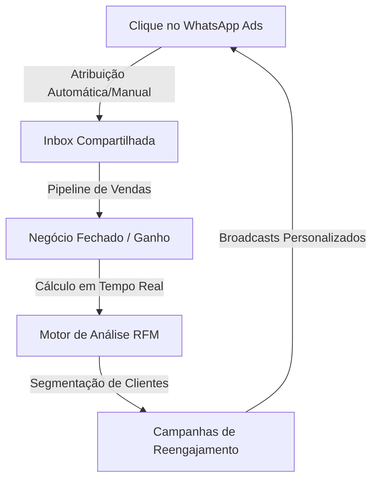

# 💬 wacrm-rfm — WhatsApp CRM & RFM Intelligence

> O template de CRM auto-hospedável definitivo para WhatsApp®, turbinado com rastreamento de atribuição de anúncios da Meta e inteligência analítica RFM (Recency, Frequency, Monetary).

<div align="center">

[](./LICENSE)
[](https://nextjs.org)
[](https://supabase.com)
[](#)

</div>

---

## ✨ O que é o wacrm-rfm?

O **wacrm-rfm** é um fork avançado do `wacrm`. Ele foi desenhado para equipes que não querem apenas gerenciar conversas de WhatsApp, mas desejam **extrair inteligência de dados, mensurar o ROI real das campanhas de tráfego pago e segmentar clientes de forma altamente estratégica** usando o modelo matemático **RFM** (Recência, Frequência e Valor Monetário).



---

## 🚀 Módulos em Destaque

### 1. 📥 Caixa de Entrada Compartilhada (Shared Inbox)
- Gerenciamento multi-agente de um único número oficial do WhatsApp.
- Organização por status de conversa, atribuição de responsáveis e notas internas.
- Suporte a modelos de mensagem oficiais aprovados pela Meta.

### 2. 📊 Atribuição de Anúncios & ROI (Módulo Mensurar)
- **Integração com a API de Marketing da Meta**: Sincronização direta de gastos, cliques, impressões e alcance de campanhas.
- **Rastreamento de Leads**: Atribuição de contatos e negócios a campanhas específicas de origem (manual ou automática via link click-to-WhatsApp).
- **Dashboard de Atribuição**: Gráficos de timeline de leads por campanha, custo por lead e retorno real sobre investimento (ROAS).

### 3. 🚦 Funil de Vendas Kanban (Pipelines)
- Quadro visual interativo para gerenciar oportunidades e negócios.
- Vinculação direta entre negócios abertos e o histórico de conversas no WhatsApp.
- Atualização em tempo real de estatísticas do funil.

### 4. ⚙️ Automação Sem Código (Flows & Automations)
- Gatilhos baseados em novas mensagens recebidas, palavras-chave específicas, horários ou novos contatos.
- Construção visual de fluxos com condicionais, timers de espera, adição automática de tags e disparos de Webhooks.

---

## 🗺️ Futuras Implementações & Roadmap (O "RFM" no Nome)

Estamos transformando este CRM na ferramenta analítica de WhatsApp mais completa do mercado auto-hospedado. Abaixo estão as próximas implementações programadas para o núcleo de inteligência:

### 🏆 Motor de Análise RFM Automático
- [ ] **R - Recência (Recency)**: Identificar há quantos dias cada cliente interagiu ou comprou pela última vez.
- [ ] **F - Frequência (Frequency)**: Medir o volume de conversões/compras de cada cliente num período de 30, 90 e 180 dias.
- [ ] **M - Monetário (Monetary)**: Somar o valor total gerado por cada contato no funil de vendas.
- [ ] **Segmentação Dinâmica**: Distribuição automática de tags como:
  * 👑 *Campeões* (Compram sempre, gastam muito, compraram recentemente)
  * 📈 *Clientes Fiéis* (Compram recorrentemente)
  * ⚠️ *Quase Adormecidos* (Não compram há algum tempo)
  * 🚨 *Em Risco* (Estão sumindo e precisam de reengajamento urgente)
  * ❄️ *Hibernando / Perdidos* (Longos períodos sem compra ou interação)

### 📲 Disparos de Broadcast Baseados em Segmento RFM
- [ ] **Automações de Recuperação**: Enviar cupons ou mensagens personalizadas via WhatsApp assim que um cliente transicionar para o segmento *"Quase Adormecido"*.
- [ ] **Agradecimento VIP**: Mensagens especiais automatizadas para o grupo de *Campeões*.

### 🔗 Meta Conversions API (CAPI) Integration
- [ ] Retorno automático de eventos de conversão (ex: "Negócio Ganho" no funil) diretamente para a Meta via API, melhorando o aprendizado do pixel e reduzindo o Custo por Lead (CPL).

---

## 🛠️ Stack Tecnológica

- **Frontend / Backend**: Next.js 16 (App Router com Turbopack), React 19, TypeScript e Tailwind CSS v4.
- **Banco de Dados & Autenticação**: Supabase (PostgreSQL, Row Level Security habilitado para isolamento de dados de usuários, Storage).
- **Provedor de WhatsApp**: API Oficial Cloud do WhatsApp (Meta Business API).

---

## 🔧 Configuração e Inicialização Local

Para rodar o projeto localmente com suporte completo à infraestrutura (incluindo Supabase via Docker local):

### Pré-requisitos
- Node.js `>= 20.0.0`
- Docker (opcional, para rodar o banco de dados Supabase local)

### Instalação
1. Clone o seu fork do projeto:
   ```bash
   git clone git@github.com:juniorthiesen/wacrm-rfm.git
   cd wacrm-rfm
   ```

2. Instale as dependências:
   ```bash
   npm install
   ```

3. Configure as variáveis de ambiente:
   ```bash
   cp .env.local.example .env.local
   # Preencha as credenciais do Supabase e as chaves de encriptação
   ```

4. Suba o Supabase Localmente (Docker):
   ```bash
   npx supabase start
   ```

5. Aplique as migrações mais recentes no banco local:
   ```bash
   npx supabase db push --local
   ```

6. Execute o servidor de desenvolvimento:
   ```bash
   npm run dev
   ```

Acesse o sistema em [http://localhost:3000](http://localhost:3000).

---

## 🛡️ Segurança de Ponta
- **Criptografia Simétrica (AES-256-GCM)**: O token de acesso do WhatsApp Business e da Meta Ads API são armazenados criptografados de ponta a ponta no banco de dados.
- **Políticas de Linha (RLS)**: Cada consulta SQL é filtrada a nível de banco utilizando as políticas do Supabase, garantindo que usuários nunca visualizem dados de outros.

---

## 📄 Licença

Distribuído sob a licença **MIT**. Sinta-se livre para clonar, alterar, colocar sua própria marca e subir em produção!
